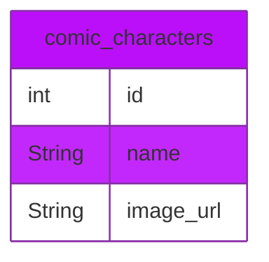

[![badge_flutter]][link_flutter_release]
![badge_github_action]
[![badge_codecov]][link_codecov]

# clean_marvel
**Goal**: A Flutter project to learn clean architecture.

## Getting Started

### Prerequisites
* Computer (Windows, Mac or Linux)
* IDE (Android Studio or Visual Studio Code)
* [fvm][dependency_fvm]
* Account on [https://developer.marvel.com/][link_developer_marvel] (TIMESTAMP, API_KEY, HASH)
* [maestro][dependency_maestro]

### Setup

```sh
# Download the project code
git clone git@github.com:YannMancel/clean_marvel.git

# Install environment
make install

# Update dependencies
make dependencies

# Generate files with build_runner
make generate-files

# Run application by default debug version
make run TIMESTAMP=[TIMESTAMP] API_KEY=[API_KEY] HASH=[HASH]
```

## Dependencies
* Flutter Version Management
  * [fvm][dependency_fvm]
* Linter
  * [flutter_lints][dependency_flutter_lints]
* Data class generator
  * [build_runner][dependency_build_runner]
  * [freezed][dependency_freezed]
  * [freezed_annotation][dependency_freezed_annotation]
* State manager
  * [flutter_bloc][dependency_flutter_bloc]
* Local Database
  * [isar][dependency_isar]
  * [isar_flutter_libs][dependency_isar_flutter_libs]
  * [isar_generator][dependency_isar_generator]
* Network
  * [dio][dependency_dio]
  * [internet_connection_checker][dependency_internet_connection_checker]
* Image Cache
  * [cached_network_image][dependency_cached_network_image]
  * [flutter_cache_manager][dependency_flutter_cache_manager]
* Path
  * [path_provider][dependency_path_provider]
* Service Locator
  * [get_it][dependency_get_it]
* Tests
  * [mockito][dependency_mockito]
  * [bloc_test][dependency_bloc_test]

## Database


## Troubleshooting

### No device available during the compilation and execution steps
* If none of device is present (*Available Virtual Devices* or *Connected Devices*),
    * Either select `Create a new virtual device`
    * or connect and select your phone or tablet

## Useful
* [Download Android Studio][useful_android_studio]
* [Create a new virtual device][useful_virtual_device]
* [Enable developer options and debugging][useful_developer_options]

[badge_flutter]: https://img.shields.io/badge/flutter-v3.16.3-blue?logo=flutter
[badge_github_action]: https://github.com/YannMancel/clean_marvel/actions/workflows/clean_marvel_CI.yaml/badge.svg
[badge_codecov]: https://codecov.io/gh/YannMancel/clean_marvel/branch/master/graph/badge.svg?token=35TQUQL0RB
[link_flutter_release]: https://docs.flutter.dev/development/tools/sdk/releases
[link_codecov]: https://codecov.io/gh/YannMancel/clean_marvel
[link_developer_marvel]: https://developer.marvel.com/
[dependency_fvm]: https://fvm.app/
[dependency_maestro]: https://maestro.mobile.dev/
[dependency_flutter_lints]: https://pub.dev/packages/flutter_lints
[dependency_build_runner]: https://pub.dev/packages/build_runner
[dependency_freezed]: https://pub.dev/packages/freezed
[dependency_freezed_annotation]: https://pub.dev/packages/freezed_annotation
[dependency_flutter_bloc]: https://pub.dev/packages/flutter_bloc
[dependency_isar]: https://pub.dev/packages/isar
[dependency_isar_flutter_libs]: https://pub.dev/packages/isar_flutter_libs
[dependency_isar_generator]: https://pub.dev/packages/isar_generator
[dependency_dio]: https://pub.dev/packages/dio
[dependency_internet_connection_checker]: https://pub.dev/packages/internet_connection_checker
[dependency_cached_network_image]: https://pub.dev/packages/cached_network_image
[dependency_flutter_cache_manager]: https://pub.dev/packages/flutter_cache_manager
[dependency_path_provider]: https://pub.dev/packages/path_provider
[dependency_get_it]: https://pub.dev/packages/get_it
[dependency_mockito]: https://pub.dev/packages/mockito
[dependency_bloc_test]: https://pub.dev/packages/bloc_test
[useful_android_studio]: https://developer.android.com/studio
[useful_virtual_device]: https://developer.android.com/studio/run/managing-avds.html
[useful_developer_options]: https://developer.android.com/studio/debug/dev-options.html#enable
