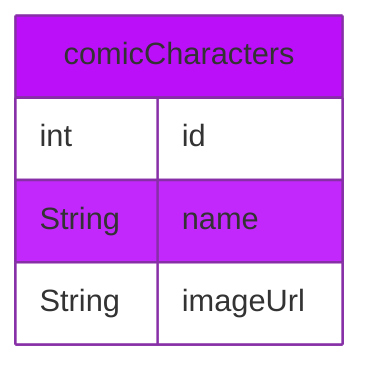

[![badge_flutter]][link_flutter_release]

# clean_marvel
**Goal**: A Flutter project to learn clean architecture.

## Requirements
* Computer (Windows, Mac or Linux)
* Android Studio or VS Code

## Setup the project in Android studio
1. Download the project code, preferably using `git clone git@github.com:YannMancel/clean_marvel.git`.
2. In Android Studio, select *File* | *Open...*
3. Select the project

## Dependencies
* Flutter Version Management
  * [fvm][dependencies_fvm]
* Linter
  * [flutter_lints][dependencies_flutter_lints]
* Data class generator
  * [build_runner][dependencies_build_runner]
  * [freezed][dependencies_freezed]
  * [freezed_annotation][dependencies_freezed_annotation]
* State manager
  * [flutter_bloc][dependencies_flutter_bloc]
* Local Database
  * [isar][dependencies_isar]
  * [isar_flutter_libs][dependencies_isar_flutter_libs]
  * [isar_generator][dependencies_isar_generator]
* Network
  * [dio][dependencies_dio]
  * [internet_connection_checker][dependencies_internet_connection_checker]
* Path
  * [path_provider][dependencies_path_provider]
* Tests
  * [mockito][dependencies_mockito]
  * [bloc_test][dependencies_bloc_test]

## Database

## Troubleshooting

### No device available during the compilation and execution steps
* If none of device is present (*Available Virtual Devices* or *Connected Devices*),
    * Either select `Create a new virtual device`
    * or connect and select your phone or tablet

## Useful
* [Download Android Studio][useful_android_studio]
* [Create a new virtual device][useful_virtual_device]
* [Enable developer options and debugging][useful_developer_options]

[badge_flutter]: https://img.shields.io/badge/flutter-v3.10.5-blue?logo=flutter
[link_flutter_release]: https://docs.flutter.dev/development/tools/sdk/releases
[dependencies_fvm]: https://fvm.app/
[dependencies_flutter_lints]: https://pub.dev/packages/flutter_lints
[dependencies_build_runner]: https://pub.dev/packages/build_runner
[dependencies_freezed]: https://pub.dev/packages/freezed
[dependencies_freezed_annotation]: https://pub.dev/packages/freezed_annotation
[dependencies_flutter_bloc]: https://pub.dev/packages/flutter_bloc
[dependencies_isar]: https://pub.dev/packages/isar
[dependencies_isar_flutter_libs]: https://pub.dev/packages/isar_flutter_libs
[dependencies_isar_generator]: https://pub.dev/packages/isar_generator
[dependencies_dio]: https://pub.dev/packages/dio
[dependencies_internet_connection_checker]: https://pub.dev/packages/internet_connection_checker
[dependencies_path_provider]: https://pub.dev/packages/path_provider
[dependencies_mockito]: https://pub.dev/packages/mockito
[dependencies_bloc_test]: https://pub.dev/packages/bloc_test
[useful_android_studio]: https://developer.android.com/studio
[useful_virtual_device]: https://developer.android.com/studio/run/managing-avds.html
[useful_developer_options]: https://developer.android.com/studio/debug/dev-options.html#enable
